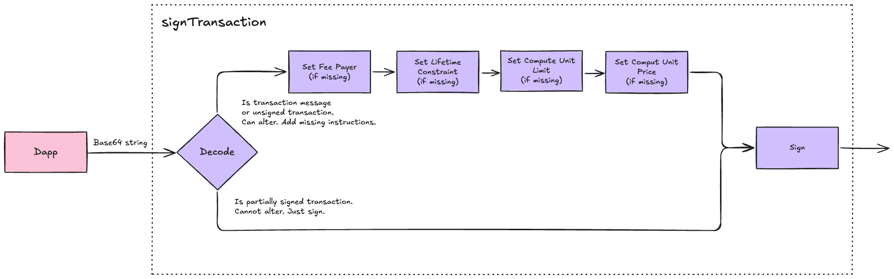

# Wallet

The `wallet` module exposes the methods `signTransaction`, `signAndSendTransation`, `signMessage`, and `signIn` to satisfy to [wallet-standard](https://github.com/wallet-standard/wallet-standard).

## Flow `signTransaction`

This schema illustrates the transaction signing flow in our Solana wallet implementation.
